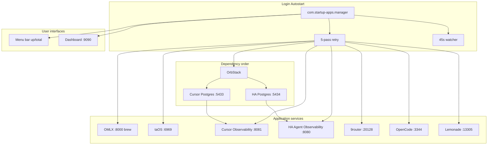

# Startup Apps — Project Summary

**Repo:** [github.com/fabiobahia1980/startup-apps](https://github.com/fabiobahia1980/startup-apps)  
**Current state:** `main`, **8/8 visible services** in registry, dynamic e2e validation, expanded doctor port audit.

---

## What Was Built

### Core capabilities

| Capability      | Implementation                                                                                                                                                                        |
| --------------- | ------------------------------------------------------------------------------------------------------------------------------------------------------------------------------------- |
| Port registry   | `[config/services.yaml](config/services.yaml)` — single source of truth for ports, autostart, dependencies                                                                            |
| Health checks   | `[startup_manager/health.py](startup_manager/health.py)` — HTTP, Docker, brew, port listener checks                                                                                   |
| Service control | `[startup_manager/supervisor.py](startup_manager/supervisor.py)` — start/stop/restart by manager type                                                                                 |
| Dashboard       | `[startup_manager/dashboard.py](startup_manager/dashboard.py)` — FastAPI on `:9090` with live status + controls                                                                       |
| Menu bar        | `[startup_manager/menubar.py](startup_manager/menubar.py)` — rumps app showing dynamic `up/total` count, service list, quit confirmation                                             |
| Port doctor     | `[startup_manager/doctor.py](startup_manager/doctor.py)` — registry conflict detection + live listener audit per TCP port                                                             |
| Login autostart | `[startup_manager/__main__.py](startup_manager/__main__.py)` — 5-pass retry + `[startup_manager/watcher.py](startup_manager/watcher.py)` (45s interval)                               |
| LaunchAgent     | `[launchagents/com.startup-apps.manager.plist.template](launchagents/com.startup-apps.manager.plist.template)` — `KeepAlive`, installed by `[scripts/install.sh](scripts/install.sh)` |

### Managed services (8 visible + 2 hidden)

| Service                  | Port     | Manager        | Project path                                      |
| ------------------------ | -------- | -------------- | ------------------------------------------------- |
| OrbStack                 | daemon   | orbstack       | —                                                 |
| OMLX                     | 8000     | brew           | `/Users/oibaf/Projects/local-llm`                 |
| taOS                     | 6969     | process        | `/Users/oibaf/Projects/taos`                      |
| Cursor AI Observability  | 8081     | process        | `/Users/oibaf/Projects/ai-agent/Cursor-dashboard` |
| HA Agent Observability   | 8080     | process        | `/Users/oibaf/Projects/ha-local-agent-mm`         |
| 9router                  | 20128    | process        | `/Users/oibaf/Projects/9router`                   |
| OpenCode                 | 3344     | process        | `/Users/oibaf/Projects/opencode`                  |
| Lemonade                 | 13305    | process        | `/Users/oibaf/Projects/lemonade`                  |
| Cursor Postgres (hidden) | 5433     | docker         | Cursor-dashboard                                  |
| HA Postgres (hidden)     | 5434     | docker         | ha-local-agent-mm                                 |
| **Dashboard**            | **9090** | built-in       | startup-apps                                      |

### Shipped PRs (all merged)

1. **PR #1** — Unified startup manager (menu bar, dashboard, LaunchAgent, port registry)
2. **PR #2** — Docker observability + Cursor Postgres dependency
3. **PR #3** — Login autostart retries, background watcher, 9router/Lemonade/HA startup fixes
4. **PR #4** — HA Postgres remapped to 5434 + menu bar live count + rumps crash fix
5. **PR #5** — "Quit manager" clarity (does not stop services)
6. **PR #6** — Reboot e2e test, doctor, OMLX login-item conflict fix

**Related repo:** [ha-local-agent-mm PR #8](https://github.com/fabiobahia1980/ha-local-agent-mm/pull/8) — Postgres `5434:5432` mapping (merged).

### Issues resolved during build

- **HA Postgres vs Homebrew Postgres** — remapped to host port 5434
- **Menu bar crash** — rumps app name `"StartupApps"` instead of `"–/–"`
- **OMLX port 8000 conflict** — oMLX Login Item removed; brew `omlx serve` owns the port
- **Cursor observability** — requires OrbStack + Postgres on 5433 before start
- **9router** — global CLI (`9router -p 20128`) with health-check wait
- **OpenCode** — `opencode serve` on 3344, autostart at login
- **Lemonade** — explicit binary path in LaunchAgent PATH
- **HA agent UI** — native `ha-agent-backend` instead of broken Docker UI path

### Operational tooling

| Script                                                             | Purpose                                              |
| ------------------------------------------------------------------ | ---------------------------------------------------- |
| `[scripts/install.sh](scripts/install.sh)`                         | venv + LaunchAgent install                           |
| `[scripts/doctor.sh](scripts/doctor.sh)`                           | Autostart conflicts + full TCP port registry audit   |
| `[scripts/e2e-reboot-test.sh](scripts/e2e-reboot-test.sh)`         | Validate all visible services + HA `db_connected`    |
| `[scripts/fix-omlx-login-item.sh](scripts/fix-omlx-login-item.sh)` | Remove duplicate oMLX login item                     |
| `[scripts/services/*.sh](scripts/services/)`                       | Per-service start/stop scripts                       |

**Logs:** `~/.startup-apps/manager.log`, `~/.startup-apps/e2e-reboot.log`  
**Restart manager:** `launchctl kickstart -k "gui/$(id -u)/com.startup-apps.manager"`

---

## Current State (Complete)

- All planned work merged; daily use requires no further action
- Reboot e2e validates dynamic visible service count + `db_connected=true`
- Doctor audits all registered TCP ports and reports conflicts
- OMLX: brew-managed at [http://127.0.0.1:8000/admin](http://127.0.0.1:8000/admin) (no Login Item)

---

## Next Steps

### Tier 1 — Close out v1.0 (recommended, low effort)

1. **Tag release `v1.0`** on `main` to mark the stable baseline
2. **Add `PROJECT_SUMMARY.md`** to the repo (this document) for onboarding and future reference
3. **Prune remote branches** on GitHub (`feat/*`, `fix/*`) now that local branches are deleted

### Tier 2 — Operational polish (optional)

| Item                              | Files to touch                                                                                                               | Value                                                              |
| --------------------------------- | ---------------------------------------------------------------------------------------------------------------------------- | ------------------------------------------------------------------ |
| **Stop all services** menu action | `[startup_manager/menubar.py](startup_manager/menubar.py)`, `[startup_manager/supervisor.py](startup_manager/supervisor.py)` | Explicit shutdown counterpart to "Quit manager"                    |
| **macOS notifications**           | `[startup_manager/watcher.py](startup_manager/watcher.py)` or `[startup_manager/menubar.py](startup_manager/menubar.py)`     | Alert when count drops below expected total                        |
| **Expand doctor**                 | `[scripts/doctor.sh](scripts/doctor.sh)`                                                                                     | Check OrbStack login setting, stale PIDs (port audit shipped)      |

### Tier 3 — Engineering hygiene (optional)

| Item                  | Value                                                                                               |
| --------------------- | --------------------------------------------------------------------------------------------------- |
| **GitHub Actions CI** | Validate `services.yaml` schema, Python imports, no duplicate ports on push                         |
| **Path portability**  | Replace hardcoded `/Users/oibaf/Projects/...` paths with env vars or `~` expansion for new machines |
| **Unit tests**        | `health.py`, `supervisor.py` brew-skip logic, port conflict detection                               |

### Tier 4 — Not needed unless requirements change

- New service onboarding workflow (template in `services.yaml` + start/stop script)
- Multi-machine sync of `services.yaml`
- Replacing shell scripts with pure-Python supervisors

---

## Suggested Immediate Action

If you approve this plan, the first deliverable would be adding `PROJECT_SUMMARY.md` to the repo (derived from this plan) and optionally tagging `v1.0`. No code changes are required for continued daily use.
